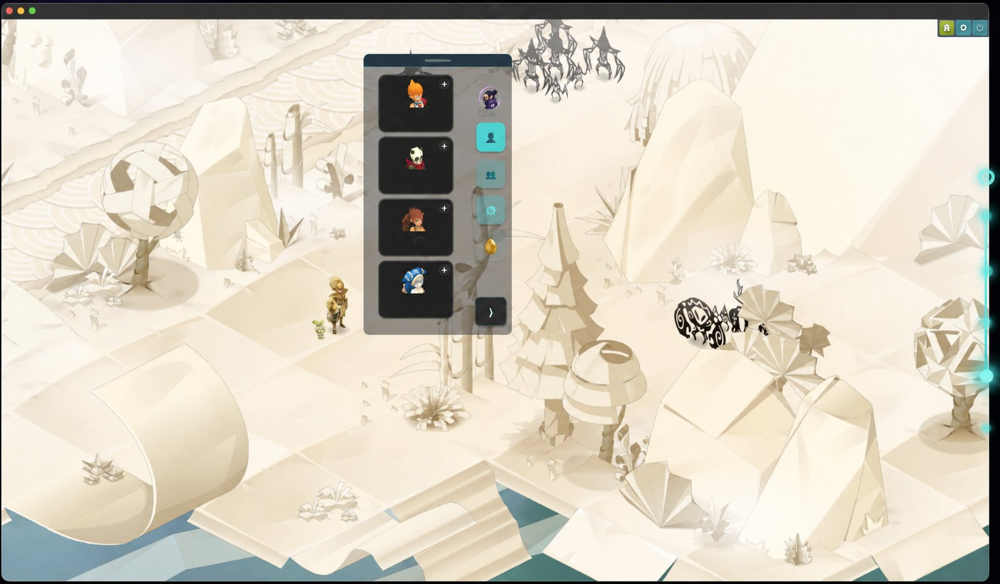
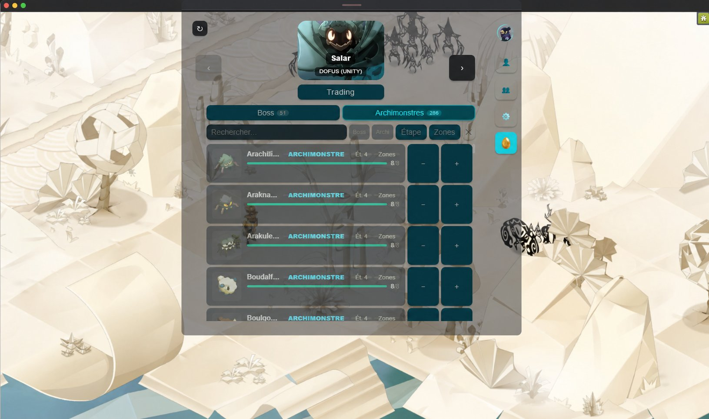

<div align="center">


# DofusManager by Tefus : Outil pour gérer le multicompte

**L'outil multicompte gratuit et open-source pour Dofus Retro et Dofus Unity.**

[](https://dofusmanager.com)
[](#installation)
[](#licence)

</div>

---

## Présentation

DofusManager est un outil pensé pour les joueurs **multicompte** sur Dofus. Il réunit la gestion des teams, l'auto focus, les raccourcis directs, le suivi Metamob et un module trading dans une interface discrète posée par-dessus le jeu. Objectif : piloter de 2 à 8 personnages confortablement, sans jamais quitter Dofus.

> **Téléchargement officiel : [dofusmanager.com](https://dofusmanager.com)** — n'utilisez que ce lien pour éviter les copies frauduleuses.

---

## Aperçu

<div align="center">

### Overlay des personnages, posé sur Dofus


### Gestion des teams en un coup d'œil


### Suivi Metamob, boss & archimonstres


</div>

---

## Fonctionnalités

- **Gestion des teams** — créez, dupliquez et organisez plusieurs équipes en drag & drop.
- **Auto focus** — basculez d'une fenêtre Dofus à l'autre de façon fluide et précise.
- **Raccourcis directs** — une touche par personnage pour un focus instantané.
- **Suivi Metamob** — quêtes ocre, boss et archimonstres synchronisés (Dofus 3.0 et Retro).
- **Module trading** — trouvez des partenaires de trade sans quitter le jeu.
- **Personnalisable** — fenêtre transparente, mode compact, premier plan, options sur-mesure.

---

## Installation

1. Rendez-vous sur **[dofusmanager.com](https://dofusmanager.com)**.
2. Téléchargez la version Windows (10/11, 64-bit) ou macOS.
3. Lancez DofusManager : vos fenêtres Dofus ouvertes sont détectées automatiquement.

---

## Respect des CGU de Dofus

DofusManager respecte pleinement les CGU d'Ankama : l'application **n'intervient jamais** sur la fenêtre de jeu, **aucun clic** n'est effectué et **aucune action** n'est répercutée sur le jeu. Le fonctionnement repose uniquement sur les processus de l'OS (Windows ou macOS) pour détecter les fenêtres contenant « Dofus » dans leur nom. Le code étant **open-source**, tout est vérifiable.

---

## Développement (site web)

Ce dépôt contient aussi le site officiel (Next.js + Tailwind).

```bash
npm install
npm run dev      # développement local
npm run build    # build de production
```

La landing se trouve dans `public/index.html`, les pages SEO dans `app/`, et les assets (logo, favicon, captures) dans `public/`.

---

## Licence

Projet open-source. Voir le fichier `LICENSE` pour les détails.

---

<div align="center">

Développé avec ♥ par **Tefus** · [dofusmanager.com](https://dofusmanager.com)

</div>
